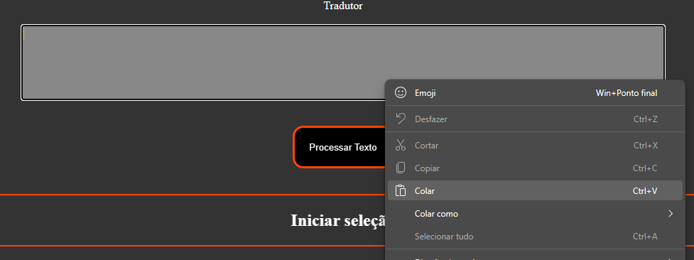
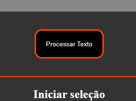
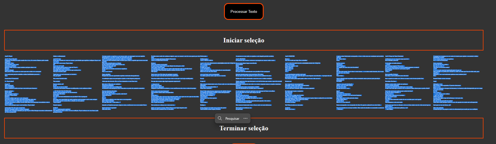
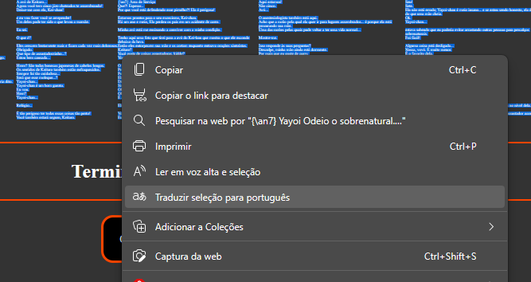

Tradutor de legendas a partir do tradutor do navegador Edge
Requisitos:
- FFMPEG <a href="https://ffmpeg.org/download.html">Link de Download</a>
- Navegador Egde <a href="https://www.microsoft.com/en-us/edge/download">Link de Download</a>
- Player de vídeo compatível com legendas SRT <a href="https://www.codecguide.com/download_kl.htm">Link de Download</a>

Para extrair as legendas utilize o comando:

ffmpeg -i arquivo_de_video.mkv legenda.srt

arquivo_de_video.mkv =  nome do arquivo de vídeo do qual a legenda será extraída, no terminal do windows o nome do arquivo pode ser autocompletado pressionando TAB

legenda.srt = nome do arquivo de legenda que será gerado

Traduzir as legendas:
- Abra o arquivo index.html no navegador EDGE
- Cole o conteúdo do arquivo de legendas no campo de texto

- Clique em "Processar texto"

- Selecione o texto entre as caixas "Iniciar" e "Terminar" seleção

- Clique com o botão direito no texto destacado e selecione a opção "Traduzir seleção para português"

- Aguarde o status sinalizar que a tradução está concluída

- Clique em construir

Agora a legenda na caixa de texto estará em português, copie todo o texto da caixa e substitua no arquivo de legenda e salve.

Siga as instruções para carregar as legendas no player K-lite
"Arquivo > Legendas > Carregar Legendas" ou Ctrl + L
Ou arraste o arquivo de legenda para dentro do player

Vídeo demonstrativo:
https://youtu.be/i5RoP3OiWTE